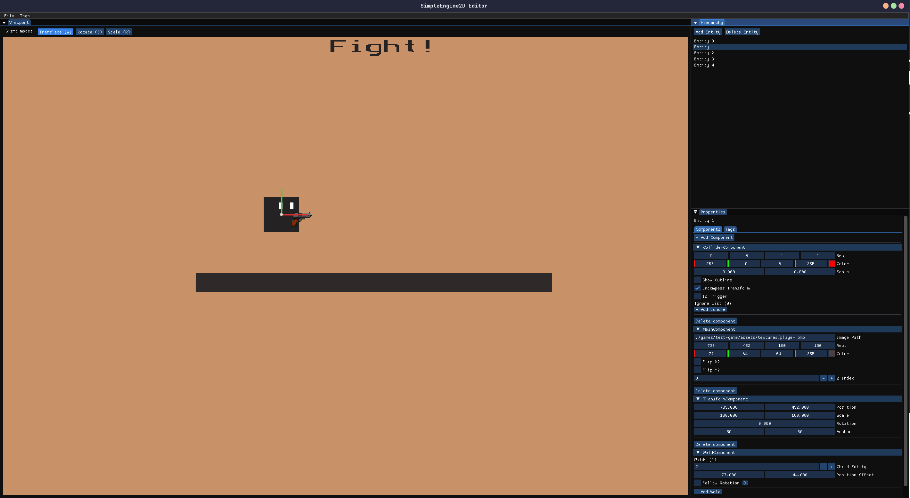

# SimpleEngine2D

**_NOTE: SimpleEngine2D is still in active development. Expect rough edges, unfinished features, and bugs. Contributions are welcome._**



---

SimpleEngine2D is a lightweight C++ 2D game engine with an integrated editor.
It provides a simple ECS-style architecture, core engine systems, and a sample game to build from. It is not meant to replace modern 2D game engines, but meant to show what I can do and also potentially make 2D game development more interesting and a little easier for some :)

Create a game scaffold --> implement your scenes/systems --> run it with the engine!

## What it does

- Provides core 2D engine systems (rendering, input, physics, collision, audio)
- Uses component-based entities for flexible game object composition
- Includes an in-repo editor for scene/entity inspection and editing

## Tech stack

**Language**

- C++17

**Core libraries**

- SDL2
- SDL2_image
- SDL2_ttf
- SDL2_mixer
- GLM
- nlohmann/json
- ImGui (editor UI)

**Build tools**

- CMake
- Make (helper commands)

## Running locally

Install dependencies:

_Automation currently supports Fedora. Support for more operating systems is coming soon (you can contribute it if you want!). If you are on another OS, check [`deps.txt`](deps.txt) and install the listed packages manually for your distro/package manager._

```bash
make deps
```

Build everything:

```bash
make build
```

Run a game:

```bash
make run NAME=test-game
```

Create a new game scaffold:

```bash
make game NAME=my-game
```

Build the editor:

```bash
make editor-build
```

Run the editor:

```bash
make editor-run
```

## Getting started: make a game

### If you want a concrete reference, use [`games/test-game`](games/test-game) as a template for scene structure, components, and systems.

1. Create a game scaffold:

```bash
make game NAME=my-game
```

2. Replace `games/my-game/src/main.cpp` with engine startup code:
    - Create one or more scene classes that inherit `simpleengine2d::core::Scene`
    - Register scenes with `simpleengine2d::core::SceneManager`
    - Start the engine with `engine.init(sceneIndex); engine.run();`

3. In your scene `setup()`:
    - Create entities with `EntityManager`
    - Add components like `TransformComponent`, `MeshComponent`, `ColliderComponent`, `TextGuiComponent`
    - Add your custom systems through `Engine::getInstance().addSystem(...)`

4. Build and run:

```bash
make run NAME=my-game
```

## Contributing

Contributions are welcome. Bug fixes, new systems/components, editor improvements, and sample content are all helpful.

**_IMPORTANT: If you open a PR, keep changes focused and include a short description of what you added/changed and your approach. If possible, also add images of what you changed._**

If you want a place to start, here are good first ideas:

- Add support for other image formats (engine currently only supports .bmp)
